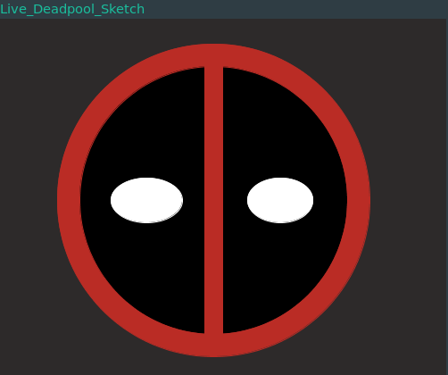

# interactive-deadpool-sketch

I was bored, this is a pretty basic deadpool sketch written in Processing, that has the center as the mouse pointer's coordinates, and the size can be increased or decreased by right clicking or left clicking respectively. This is also my first processing program (^_^)
